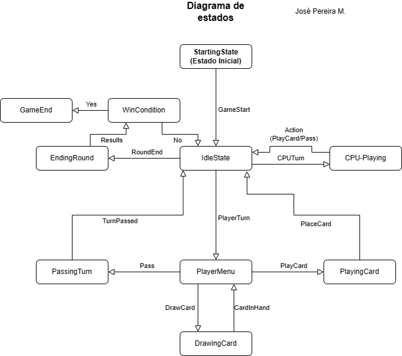

# Gwen't

This work is licensed under a
[Creative Commons Attribution 4.0 International License](http://creativecommons.org/licenses/by/4.0/)

Context
-------

This project's goal is to create a (simplified) clone of the
[_Gwent_](https://www.playgwent.com/en)card game developed by [_CD PROJEKT RED_](https://cdprojektred.com/en/)

---
# Observations for Tarea 3 - Entrega Final.
## Design Patterns
### Card Effects
For the Card effects an Effect trait was created. This would dictate how the Cards with effects
should behave. Also, a Composite Pattern was implemented to stack effects to the Cards in the field,
since they could be affected by multiple effects froms cards on the same row or a Climate Card effect.
### Win Condition
When a Player loses all of their gems, the game is over and the win condition is reached.
To notify the Controller of this, an Observer Pattern was implemented, using the Game Controller
as the Observer and the Player as the Subject.

# Observations for Tarea 3 - Entrega Parcial 4.

## State Diagram

# Observations for Tarea 2- Entrega Final.

Here you can find important observations about the design and structure of the project while developing
this assignment. It will be divided in subsection depending on the subject that requires to be addressed.

### Board implementation

While designing the board for Gwen't, the main problem question was if it should be one whole board that
contained both players or if it could be implemented as two sides of the board. Both ideas have their own
advantages and challenges, but in the end it was decided that the easier way was to make it so each player
has an independent side of the board. This avoids the problem of knowing which player was doing certain actions
on the board, like placing cards.

### The ClimateCard slot

Given that each player has its own board, we have a Slot for a ClimateCard on each side. This is the main
problem with the design that has been noticed, but if the implementation of the game loop (turn flow and so)
takes into account that given that a player placed a ClimateCard also place it on the opponent's field, then
there should be no problems (inb4 it there are problems).

### Changes in visibility and privatization

Almost every variable has been made protected or private, depending on if the variables where going
to be used on a inheriting class. Most Traits have protected variables.

